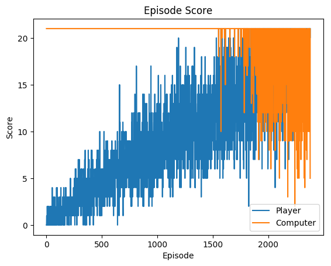
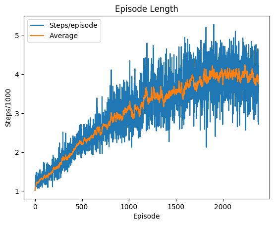
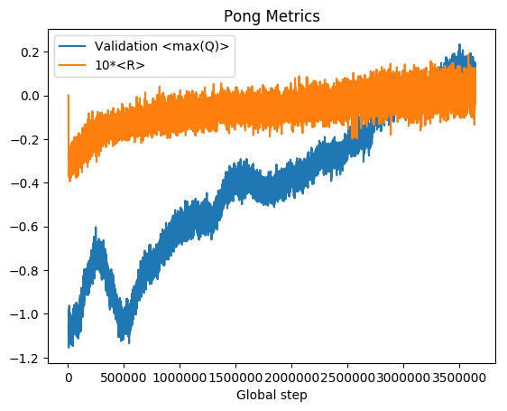

# Deep Q Learning with Pong

## Introduction

This project is an attempt to replicate some of the results of the [Google DeepMind paper by Mnih et. al.](https://arxiv.org/abs/1312.5602) wherein the authors train a Deep Q-Network (DQN) to play a variety of classic Atari video games, such as Seaquest, Breakout, Q*bert, Space Invaders, Pong, etc. Specifically, this project is an attempt to replicate the "Pong" part of the experiment, by training a convolutional neural network (CNN) on raw pixel data (i.e. what a human would see when playing the game). We find that although the computational and temporal resources necessary to train even a simple network adequately are quite large, it can be done, and we have successfully trained an agent that is capable of playing Pong at an adequate level, and is capable of defeating the built-in "AI" roughly 1/3 of the time during training.

## Theory

The DQN is based on the Q-learning algorithm by [Watkins (1989)](http://www.cs.rhul.ac.uk/~chrisw/new_thesis.pdf). In it, we have an a action-value function q(s,a), which is defined as the expectation of (possibly discounted) future rewards in a Markov decision process (MDP) starting from state s and action a and following the policy $\pi$:

We train the agent using a model-free, off-policy method (i.e. Q-learning), where the policy to iterate ($\pi$) is simply the greedy policy , where $Q(s,a;\theta)$ is our estimate of $q(s,a)$ parametrized by the network weights \theta. The behavioral policy $\mu$ is simply the epsilon-greedy version of $\pi$, where we have a 1-$\epsilon$ chance of following the policy $\pi$, and a probability $\epsilon$ of selecting an action uniformly at random from the set of actions (stay, up, down). In the tabular case, policy iteration proceeds by utilizing the Bellman update equation

which converges on the optimal policy when all states are visited infinitely often.

However, since we don't have infinite time, nor the resources to enumerate every possible state of Pong, we turn to function approximation with a neural network. In this case, the Bellman equation update is used as a target for a regression task: the neural network's job is to predict the action-value for each action given the current state. This is done by minimizing the loss function

with respect to $\theta$ (while holding the weights from the previous iteration, $\theta^\prime$, fixed). One can then initialize the network with some randomly-chosen weights, feed in the states $S_i$ to the network to get $Q(S_i,a;\theta)$, get the action from the behavioral policy $A_i = \mu(S_i)$, observe the next state $S_{i+1}$ and associated reward $R_{i+1}$. We then plug this back in the network to get $Q(S_{i+1},a^\prime,\theta^\prime)$, which we can use to evaluate the target $y$, and then calculate $\nabla_\theta L$, which you can use to update your weights using your favorite optimizer (SGD, RMSprop, Adam, etc.) to minimize $L$. As the network output approaches the target (policy evaluation), the policy itself changes since it is based on the output $Q$ (policy iteration), so that the agent continually improves (the standard recipe for generalized policy iteration).

## Experiment

Here we describe the experiment itself. We will outline the network architecture, the "replay memory", hyperparameter choices (and specifics of the implementation), and the results.

### Architecture

The architecture of the network used is that of a typical CNN. It is composed of several layers, each composed of a 2D convolution, a ReLU nonlinearity, and a 2x2 max pool, followed by several fully connected layers. The final layer is simply three neurons (with no activation applied), corresponding to each of the three possible actions.

The input is preprocessed so that the raw RGB pixels, originally of dimensions (210,160,3), are cropped to (160,160,3) in a way that retains most of the play space. Then, a single color channel which shows the most contrast (green, in this case), is kept, and the other two discarded, reducing the dimension to (160,160,1). Then, the image is downsampled to (80,80,1) using 2x2 max pooling. Finally, it is cast to a boolean array so that any pixel with intensity $I>100$ is mapped to $1$, and $I \le 100$ is mapped to $0$. This is done so that more elements of the replay memory (explained in the next section) could fit in memory (since booleans have a memory footprint of a single byte, compared to 4 bytes with a 32-bit float or integer). We believe no significant information was lost from this preprocessing step, since the game space is very sparse and simple to begin with. Then, the 4 previous frames are stacked on top of each other to form a tensor of dimension (80,80,4). This provides the network with a way of predicting the velocity of the ball, which would be impossible with just a single frame (you can learn the position easily, but how do you tell if it's going right or left?)

The individual layers are as follows:

- X: (80,80,4) boolean, cast to float
- conv0: 32 (8,8) filters with stride 4, same padding, ReLU activation, 2x2 max pool
- conv1: 64 (4,4) filters with stride 2, same padding, ReLU activation, 2x2 max pool
- conv2: 64 (3,3) filters with stride 1, same padding, ReLU activation, 2x2 max pool
- A3: 256 neurons, ReLU activation
- A4: 256 neurons, ReLU activation
- Y: 3 neurons, no activation

It was decided that since there is no difference in the environment between the training and testing of the agent, we would use no regularization.

### Replay memory

Since in Q-learning the policy is being iterated at the same time as it is being evaluated, this can lead to some instability, as the target function $y$ is continuously changing in response to the changes in the network. Furthermore, online learning (only updating based on most recent experiences) can cause the network to forget how to interpret states it has seen in the distant past. By using a technique known as replay memory, this process can be stabilized somewhat, and training accelerated. Replay memory incorporates an element of supervised learning to the process by saving all past "experiences" in this case, an "experience" is a tuple containing a state/action pair, along with the subsequent state and reward (and a flag identifying whether the next state is terminal or not): $e = (S_i, A_i, R_{i+1}, S_{i+1}, \text{is_terminal})$. One may see that each experience contains all the elements necessary for computing the network target $y$, independent of what the network weights were at the time the experience was collected. By saving a very large number of experiences collected at various points throughout the training process to this replay memory, we can sample from this set, calculate the network target for the current weights, and perform minibatch updates. The advantages of this are twofold: first, since each experience may be sampled many times, the agent is able to learn from its past history multiple times, rather than just once (as it experiences it). Second, if the replay memory is very large, randomly sampled experiences will be largely uncorrelated, which provides a more stable, complete distribution of states to learn from. With online learning, on the other hand, the states from which the agent learns will all be highly correlated in time, which can lead to the aforementioned instability.

### Hyperparameters/specifics

There are a number of hyperparameters and subtleties about this implementation that require further explanation, and will be addressed one by one:

1) REPLAY_MEM_LEN = 150000: The max number of experiences to include in the replay memory. The memory acts like a queue, so that older experiences are discarded as new ones are added (FIFO).
2) OBSERVE_STEPS = 5000: An initial number of steps to play with a uniformly random policy in order to collect experiences before actual training begins.
3) STEPS_TO_SKIP = 1: Instead of making decisions on every frame, the agent skips a number of frames specified by this parameter, during which the default action is to do nothing. This increases the rate at which episodes are completed and the frequency of rewards (in terms of wall time).
4) MAX_EPSILON = 0.8: The initial value of the $\epsilon$ parameter used in the epsilon-greedy behavioral policy $\mu$.
5) MIN_EPSILON = 0.05: The minimum value of $\epsilon$.
6) EPSILON_ANNEALING_STEPS = 400000: The number of steps over which $\epsilon$ is linearly annealed from its maximum to minimum value, after which it remains constant at the minimum.
7) LEARNING_RATE = 1e-6: The learning rate for the Adam optimizer. The values of the other Adam parameters $\beta_1$ and $\beta_2$ were default.
8) GAMMA = exp(-1/100) $\approx$ 0.99: The reward discount rate. The parametrization of $\gamma = e^{-1/n}$ allows one to think in terms of how many frames the action-value function should look into the future for rewards. This way, after $n$ steps, the expected future reward should be discounted by a factor of $1/e \approx 0.368$, after which future rewards quickly cease contributing to the value function.
9) BATCH_SIZE = 128: The size of the batches sampled from replay memory.
10) DOWNSAMPLE = 2: The factor by which the raw input is downsampled after performing the cropping operation to (160,160). The new dimensions are then (160//DOWNSAMPLE, 160//DOWNSAMPLE).

Hopefully all other hyperparameters should be self-explanatory.

### Results

We now discuss the results. The agent was trained in the manner described above, with the given hyperparameters, for a total of 2380 episodes, with approximately 3.6 million global steps. This was run on a GTX 1080 GPU for a total wall time of 5 days and 22 hours. During the training, we monitor a number of different metrics in order to assess the progress of the agent. One of the most basic metrics is the final score of the episode:

You can clearly see the agent's score increasing, while the hardcoded "AI" opponent consistently wins each game, up until about episode 1600, where the agent is finally able to defeat the "AI", and begins to consistently win future games with an increasing frequency, and by a larger margin.

Another important metric is the length of each episode:

We can see that this steadily increases as well. Initially, the agent quickly loses each game, leading to short episodes. As its skill increases, the agent and opponent are able to "rally" by hitting the ball back and forth, prolonging the games/episodes. Once the agent becomes comparable to the opponent, the rate at which the number of steps per episode increases begins to slow, as the opponent can't keep hitting the ball back and forth forever without making a mistake. As the agent becomes even more skilled, it may be possible to even exploit weaknesses in the opponent's strategy to defeat it more quickly rather than simply acting to return the ball, although we have not seen this behavior yet.

Finally, we have a combined plot of a moving average of the reward gained by the agent (orange), and the maximum value of $Q$, averaged over a static held-out set of states (blue).

The held-out set of states are a set of 250 states (i.e. a batch of (250,80,80,4) preprocessed images) which are collected independently of the training process using a random policy. 10 episodes are played (leading to roughly 6000 states collected total), from which these 250 are uniformly sampled to assure low correlation, and are then saved to disk. As the agent is trained, the average maximum value of $Q$ on this set of states is indicative of the agent's "confidence" that it can score a point starting from these states, as larger values of Q mean that the agent expects larger future rewards from following the greedy policy. This metric has that advantage that it is not nearly as noisy as the raw episode score or length, so that it is easy to follow and track the progress of training. The downside is that the actual value is hard to interpret, as it depends on the magnitude/frequency of rewards, the value of $\gamma$, etc., and therefore has no meaning in absolute terms. Still, the relative, monotonic increase of this value ensures that training is progressing smoothly, even if the other metrics have large variance and are difficult to track.

Finally, the ultimate result is watching the agent play the game, which you can watch [here](./animation.gif). You can see that the majority of the agent's points come from taking advantage of the way the ball is served up after the opponent has lost a point to the agent, which it uses to consistently chain points. However, it seems that the agent's skill in other areas is considerably lower, as it can't effectively return shots placed in the upper part of the screen (though it comes close sometimes). I believe the propensity of near-misses might come from the fact that the agent can't localize the ball in relation to the paddle effectively due to downsizing and max pooling in the intermediate layers, which introduces some uncertainty in the position.

## Discussion and conclusion

There are numerous improvements which could be used to iterate on this experiment. In the future, it might be more efficient to put the replay memory entirely on the GPU so that there is no time wasted sending minibatches from the CPU to GPU, which can act as a bottleneck. This was likely happening to me, as my GPU utilization never got higher than about 10% during training. New frames could be gathered on the CPU and then sent in batches of 1000 or so to the GPU where they would replace old experiences in the replay memory. Then the only information necessary to send from CPU to GPU to do training is the indices of the experience in replay memory, which is computationally trivial. Putting states through  the network in order to determine the behavioral policy will still require sending arrays to the GPU, but these are much smaller than the batches of 128 we use for training.

The training could also be stabilized even further by utiliziong [double Q-learning](https://papers.nips.cc/paper/3964-double-q-learning), where two separate networks are trained to predict the action-value function. At each step, one of the networks (call it A) is selected to evaluate the current state and return an action via the epsilon-greedy policy, while the other one (B) is used to estimate the maximum Q value of the next successive state. Using B's estimate for the maximum leads to an unbiased estimate for A's target value, leading to more precise weight updates for A's network. The same procedure can then also be used with $A \leftrightarrow B$ to update B's weights. Deviating from Q-learning, we could also explore the same problem but using policy gradient methods, which have the advantage that they don't have a constantly shifting regression target like Q-learning. Perhaps we will explore some of these options in the future.

Of course, there are also further hyperparameter adjustments that may be made (this one was run with our first guess, so there is definitely room for improvement). For example, the reward discount factor $\gamma$ could be made dynamic so that in the parametrization $\gamma = e^{-1/\bar{n}}$, $\bar{n}$ could be defined as a running average of the number of frames between scoring. This way, the agents "reward memory" will have a dynamic length. This avoids situations in which $\gamma$ is initially set too low, and the agent is slow to respond to moves unti the last second, or when $\gamma$ is initially set too high and training proceeds very slowly since it must look many steps into the future, but the current policy hasn't been evaluated satisfactorially yet.

In conclusion, this experiment was very successful. We were able to reproduce the results of the DeepMind paper on commercially-available hardware in a semi-reasonable amount of time, track the progress using some conventional and unconventional metrics, and learn some very important aspects of reinforcement learning and GPU acceleration of training.

## Appendix

If you want to try out the agent for yourself, the most recent checkpoint is located in [this folder.](./Checkpoints/7/) Just download this folder and point the parameter SAVE_PATH to it in the file Pong2.0.1.py. To continue training, set IS_TRAINING to True, else set it to False if you would like to watch it play against the computer opponent. Make sure you have a proper TensorFlow and AI Gym installation. The only two python files necessary should be Pong2.0.1.py and utils.py (Pong2.0.py is an older version).
